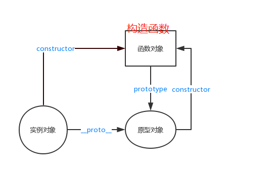
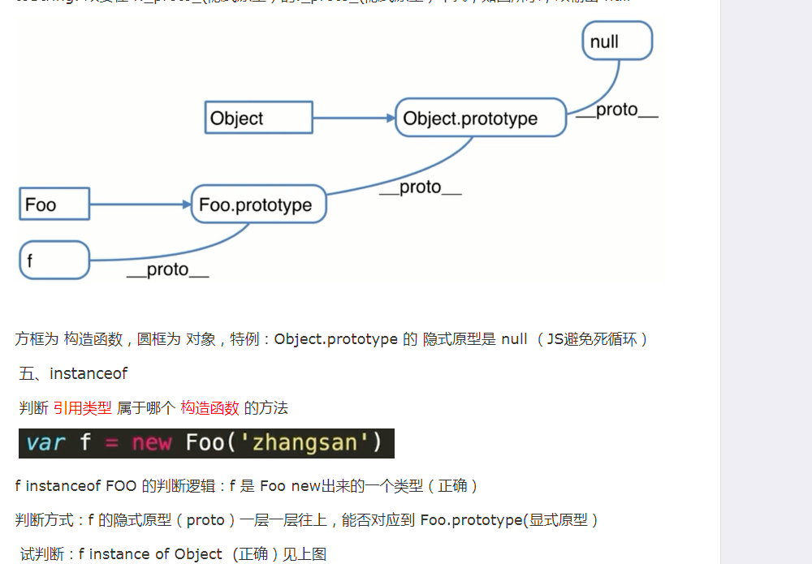
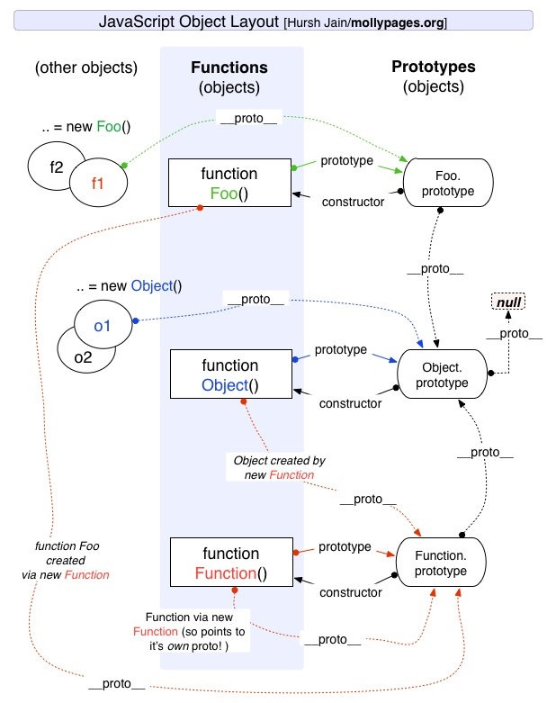

- shouwang.ping@gmail.com
- Element对象
- http://shuilizijin.jianyitong.com/minProject/main/index.html
- https://cn.eslint.org/
- 我要自学网：https://www.zcool.com.cn/work/ZMjM0NDc0OTI=.html

- https://www.yuque.com/xytech/flutter
- https://docxtemplater.readthedocs.io/en/latest/
- https://www.electronjs.org/ 桌面应用
- https://fivexu.github.io/ui/#/dotRun
- https://blog.csdn.net/future_todo/article/details/60956942
- https://www.kancloud.cn/jikeytang/qq/87646
- 看云 github登录
- https://legacy.gitbook.com/book/llh911001/mostly-adequate-guide-chinese/discussions?state=open&page=2
- 有道云
- https://llh911001.gitbooks.io/mostly-adequate-guide-chinese/content/ch1.html#%E4%BB%8B%E7%BB%8D
- https://www.zcool.com.cn/
- http://www.ionic.wang/article-index-id-57.html
- https://legacy.gitbook.com/login?next=%2Fread%2Fbook%2Fli-xinyang%2Ffrontend-notebook%2F
   - gitbook


- https://www.html.cn/
- https://www.json.cn/
- https://segmentfault.com/a/1190000014772044
   - 手机号 hhldm888!

- https://sheetjs.com/
- https://tongji.baidu.com/research/  百度流量统计
- https://nwjs.io/
- https://www.sucaihuo.com/templates 素材火
- https://msdn.itellyou.cn/   我告诉你
- https://task.zbj.com/?w=6&k=%E5%89%8D%E7%AB%AF%E5%BC%80%E5%8F%91 猪八戒
- FunDebug
   - https://blog.fundebug.com/2017/04/04/nodejs-async-await/
   - https://blog.fundebug.com/2018/07/24/vs-extensions/
   - https://blog.fundebug.com/2017/07/17/10-javascript-difficulties/
   - https://blog.fundebug.com/2018/05/29/30-amazing-vuejs-open-source/
## js引擎提供的构造函数
- new Object()
- new Array()
- new Function()
- new String()
- new Blooen()
- new Error()
- new Math()
- new Xml()
- new Image()
- new Proxy()
- new FileReader()
- new FormData()
- new URLSearchParams()
## 常用api
### Math
   - pardeInt
## 概念解释
> JavaScript 是一种基于原型的语言 (prototype-based language)，这个和 Java 等基于类的语言不一样。
- [各类网址导航](https://nav.imaring.com/)
- [前端一百问](https://juejin.im/post/5d23e750f265da1b855c7bbe)
- [前端进阶](https://muyiy.cn/question/)
- [问题博客](https://github.com/yygmind/blog)
- [资料](https://www.yuque.com/advanced-frontend)
- [待](https://qq1037305420.github.io/Blog/nav.01.externals/)
- [原型链](https://www.cnblogs.com/dengyao-blogs/p/11481326.html)
   
   
   
- [组件库](https://www.toutiao.com/i6718405521088446988/?timestamp=1564450212&app=news_article&group_id=6718405521088446988&req_id=20190730093011010018026159736CF92)
- js是先进行预编译还是变量提升
- 虚拟Dom
   1. 易于扩展，高性能，多端运行 toString服务端渲染。。。
- AST 抽象语法树
> 更多：v8 引擎
## 校验 检测方式
**6种方式**
- typeof (无法检测引用类型里的Array) 对象，数组，null返回的都是object
- xx instanceof type (用来检测引用类型是Array/Function/Object, 无法检测基本类型) 谁是谁的实例
```js
({}) instanceof Array // false
[] instanceof Array // false
```
- Object.prototype.toString.call([]) => "[object 构造函数]" 不能判断实例
```js
Object.prototype.toString.call([]) // "[object Array]"
Object.prototype.toString.call({}) // "[object Object]"
Object.prototype.toString.call(1) // "[object Number]"
```
- constructor 判断当前是谁构造出来的
```js
[].constructor === Array // true
```
- Array.isArray()
```js
Array.isArray(1) // false
Array.isArray([]) // true
```
- in
```js
let obj = {
  name: 'dsf'
}
"name" in obj // true
"name11" in obj // false
```
- es6 的改进处理
## 判断
- 'x' in obj  判断x属性是否存在obj对象中
- if else elseif 区别
- if if if 每一个都会执行一遍
- if else if 执行满足条件的 执行效率更高

## number
- number 特性
## undefind
- 特性
## null
-特性

## 字符串
- str.startsWith('v-')
```js
"v-model".startsWith('v-') // true
```
## 对象
一切皆对象(普通对象，实例对象，原型对象，普通函数，构造函数)
- 封装
- 继承 `bind, apply, call`
- 多肽
- Object.key(obj) // 把对象的key转化为一个数组
### 对象`自带方法属性`（原型链中）
- toString
- dinfinProperty
- Objesc.assign() - 浅拷贝
### 方法
- Object.key(obj)
> 相对于for in 不会遍历原型链中的属性
### 创建对象
- 直接字面量 let a = {}
- new 关键字 let a = new Object()
- Object.create()   let a = Object.create()
### 继承
（构造）函数具有的方法
> `apply(this, a, b)`, `call(this, array)`, `bind`
- apply
- call
- bind
> apply(), call() 会立即执行, bind() 不会立即执行
### 拷贝对象
- Object.create()
- Json.parse()

### 名词解释
- 面向对象
- 实例化对象 / vue实例 / new一个实例 /可见渲染元素都是一个实例
- 创建过程
- 实例化过程.挂载理解

## 数组 `33个`  
> 是(`true`)否(`false`)改变原数组<br>
> 7个方法会改变原数组, 其他为创建新数组 vue 中函数劫持(AOP 函数切片)重写了这7个方法<br>
> 具有遍历功能的：map, forEach, reduce, filter
- true: pop, push, reverse, shift, sort, splice, unshift
- false: concat, join, slice, toString
1. 添加
- push()
- unshift() 从头部添加 `true` 
- concat() `false`
2. 删除
- pop() 删除最后一个 `true`
- shift() 删除第一个
3. 子数组
- splice(删除的开始位置, 删除的个数, 添加的元素，可为空)
- slice()
4. 排序
- reverse()
- sort()
5. 转化
- toString()
- toLocaleString()
- join()
6. 位置方法，查找
- indexOf()
- lastIndexOf()
- findIndex()
- includs()
7. 迭代方法,操作数组的callback方法
- map() `会分配内存空间，返回新数组，不改变原数组，不对空数组检测` **9ms**
   - 需要改变数据，操作数据 return
   - 返回一个新数组，可链式调用 arr.map().filter() 函数式编程
   - 待定：jsPref测速 =》map是高阶函数功能更强的同时,性能会更差，forEach应该比map快才对。因为forEach是直接对原来的数组操作，更加高效。map必然要分配新的空间来存储，有开销。函数式优点在于写法更加优雅，像数学公式，易于理解。
   - 能用forEach()做到的，map()同样可以。反过来也是如此。
- forEach() `不会返回，callback可更改原数组，不对空数组检测` **3ms**
   - 只是赋值，做一些事
- filter()
- flat `扁平化 es6`
- every()
- some()
8. 缩小方法
- reduce()
- reduceRight()
9. 扩展方法
- from()，of()，prototype.copyWithin()，includes()
## 函数
- 写法
```js
   function test() { // 声明式

   }
   var test = function () {} // 表达式
``` 
- 分类
1. 构造函数
   - 我们先了解一下构造函数的new都做了些什么？简单来说，分为四步：
      1. JS内部首先会先生成一个空对象；
      2. 再把函数中的this指向该对象；
      3. 然后执行构造函数中的语句；
      4. 最终返回该对象实例。
2. 自执行函数
3. 箭头函数
   - 与普通函数区别
      - 箭头函数不会创建自己的this（重要！！深入理解！！）
      - 箭头函数没有原型prototype
      - 箭头函数的this在定义的时候继承自外层第一个普通函数的this。
      - 箭头函数继承而来的this指向永远不变（重要！！深入理解！！）, 但可以修改它要继承的对象的this
      - .call()/.apply()/.bind()无法改变箭头函数中this的指向
         - .call()/.apply()/.bind()方法可以用来动态修改函数执行时this的指向，但由于箭头函数的this定义时就已经确定且永远不会改变。所以使用这些方法永远也改变不了箭头函数this的指向，虽然这么做代码不会报错
      - 箭头函数不能作为构造函数使用
      - 箭头函数没有自己的arguments 箭头函数的this指向全局
      - 箭头函数的this指向普通函数时,它的argumens继承于该普通函数
      - 使用new调用箭头函数会报错，因为箭头函数没有constructor
      - 箭头函数不能用作Generator函数，不能使用yeild关键字
      - 箭头函数不支持new.target
      - 如果箭头函数外层没有普通函数，严格模式和非严格模式下它的this都会指向window(全局对象)
      - 箭头函数不支持重命名函数参数,普通函数的函数参数支持重命名
      - rest参数获取参数列表
        ```js
         let a = (a, ...bcd) => { // rest参数（形式为...变量名） 用于获取函数的多余参数，这样就不需要使用arguments对象了
            console.log(a, bcd); // 1 [2, 3, 4]
         };
         a(1, 2, 3, 4);
        ```
   - [更多1](https://www.jianshu.com/p/2e01b9fd210d) [2](https://www.jianshu.com/p/422f7c033f36)

### 函数节流，防抖
- 研究underscore, lodash 节流，防抖源码
- 节流：在几秒时间内 只有一次触发有效
- 防抖：停止输入后间隔几秒触发（）
### 函数劫持
> 函数劫持(函数切片，AOP:面向切片编程)
传参处理
- Vue 对数组的监听
### 回调函数形式
promise 传入函数 如何返回回调函数值=》例如：antd表格 设置项中 如何能返回时间回调值 function callback()
- 因为里面会执行这个函数 把值传出去了
```js
function aa(cb) {
  let arr = [1,2,3]
  cb(arr)
}
```
## 鼠标相关
- 事件 event
   - e.clientX
## 正则匹配
- 正则匹配替换
- ^ 匹配开始
- [az] 区间 小写a到小写z
- (a|b) 或 a 或 b
- $ 结尾
- +@ 必须紧跟@
## 其他方法
- Object.keys
- with(Obj) {}
- 子组件渲染完成后 才会执行父组件的mounted(子组件渲染完成)
- compositionApi
- v-if="name in Obj" // 属性是否在对象里面 返回布尔值
## 循环
1. while()
```javascript
while(num < 10) { // 执行条件，不确定循环次数，只要条件满足就执行，比如递归寻找上级节点

}
```
2. `for() i++ for in/of` 遍历对象 会遍历`原型链`
2. for() i++ for in/of
- for in 适用于对象 会遍历所有课枚举属性
- for of 适用于数组

3. forEach()
4. map()
## 模块化规范
   1. commonJs - require()
   2. seaJs - requireJs - define()
   3. es6
   4. AMD
   5. CMD
## 路由
- 浏览器路由
- patchange
## 源码原理理解
必须深入理解的源码实现原理
**整理后移入各个模块**
1. promise 实现原理
2. MVVM MVC底层原理
3. vue底层双向绑定 / render function底层做了些什么 virtual dom用到的diff算法
4. vuex
   - new Vue() new了一个Vue实例对data进行依赖收集 双向绑定 更新视图
   - minxin 混入钩子函数 to do...
## 重要概念
**整理后移入各个模块**
- 运行，编译原理，词法结构
- js引擎渲染机制
- v8垃圾回收机制 
   - [更多](https://www.jianshu.com/p/90927600671d)
- 工程化
- 工作流
- 自动化部署
- Docker 部署
## ajax => axios
- ajax
- axios
Axios是一个基于Promise的HTTP库，用于浏览器和node.js中[更多](https://www.jianshu.com/p/f438914a2437), [文档](https://www.kancloud.cn/luponu/axios)
```js
axios.defaults.withCredentials = trun
// 在请求或响应被 then 或 catch 处理前拦截它们
axios.interceptors.request.use(function(config) {
    // 在发送请求之前做些什么
    return config;
  }, function (error) {
    // 对请求错误做些什么
    return Promise.reject(error);
})
// 所有请求配置 只有 url 是必需的。
axios({
  // `url` 是用于请求的服务器 URL
  url: '/user',

  // `method` 是创建请求时使用的方法
  method: 'get', // 默认是 get

  // `baseURL` 将自动加在 `url` 前面，除非 `url` 是一个绝对 URL。
  // 它可以通过设置一个 `baseURL` 便于为 axios 实例的方法传递相对 URL
  baseURL: 'https://some-domain.com/api/',

  // `transformRequest` 允许在向服务器发送前，修改请求数据
  // 只能用在 'PUT', 'POST' 和 'PATCH' 这几个请求方法
  // 后面数组中的函数必须返回一个字符串，或 ArrayBuffer，或 Stream
  transformRequest: [function (data) {
    // 对 data 进行任意转换处理

    return data;
  }],

  // `transformResponse` 在传递给 then/catch 前，允许修改响应数据
  transformResponse: [function (data) {
    // 对 data 进行任意转换处理

    return data;
  }],

  // `headers` 是即将被发送的自定义请求头
  headers: {'X-Requested-With': 'XMLHttpRequest'},

  // `params` 是即将与请求一起发送的 URL 参数
  // 必须是一个无格式对象(plain object)或 URLSearchParams 对象
  params: {
    ID: 12345
  },

  // `paramsSerializer` 是一个负责 `params` 序列化的函数
  // (e.g. https://www.npmjs.com/package/qs, http://api.jquery.com/jquery.param/)
  paramsSerializer: function(params) {
    return Qs.stringify(params, {arrayFormat: 'brackets'})
  },

  // `data` 是作为请求主体被发送的数据
  // 只适用于这些请求方法 'PUT', 'POST', 和 'PATCH'
  // 在没有设置 `transformRequest` 时，必须是以下类型之一：
  // - string, plain object, ArrayBuffer, ArrayBufferView, URLSearchParams
  // - 浏览器专属：FormData, File, Blob
  // - Node 专属： Stream
  data: {
    firstName: 'Fred'
  },

  // `timeout` 指定请求超时的毫秒数(0 表示无超时时间)
  // 如果请求话费了超过 `timeout` 的时间，请求将被中断
  timeout: 1000,

  // `withCredentials` 表示跨域请求时是否需要使用凭证
  withCredentials: false, // 默认的

  // `adapter` 允许自定义处理请求，以使测试更轻松
  // 返回一个 promise 并应用一个有效的响应 (查阅 [response docs](#response-api)).
  adapter: function (config) {
    /* ... */
  },

  // `auth` 表示应该使用 HTTP 基础验证，并提供凭据
  // 这将设置一个 `Authorization` 头，覆写掉现有的任意使用 `headers` 设置的自定义 `Authorization`头
  auth: {
    username: 'janedoe',
    password: 's00pers3cret'
  },

  // `responseType` 表示服务器响应的数据类型，可以是 'arraybuffer', 'blob', 'document', 'json', 'text', 'stream'
  responseType: 'json', // 默认的

  // `xsrfCookieName` 是用作 xsrf token 的值的cookie的名称
  xsrfCookieName: 'XSRF-TOKEN', // default

  // `xsrfHeaderName` 是承载 xsrf token 的值的 HTTP 头的名称
  xsrfHeaderName: 'X-XSRF-TOKEN', // 默认的

  // `onUploadProgress` 允许为上传处理进度事件
  onUploadProgress: function (progressEvent) {
    // 对原生进度事件的处理
  },

  // `onDownloadProgress` 允许为下载处理进度事件
  onDownloadProgress: function (progressEvent) {
    // 对原生进度事件的处理
  },

  // `maxContentLength` 定义允许的响应内容的最大尺寸
  maxContentLength: 2000,

  // `validateStatus` 定义对于给定的HTTP 响应状态码是 resolve 或 reject  promise 。如果 `validateStatus` 返回 `true` (或者设置为 `null` 或 `undefined`)，promise 将被 resolve; 否则，promise 将被 rejecte
  validateStatus: function (status) {
    return status >= 200 && status < 300; // 默认的
  },

  // `maxRedirects` 定义在 node.js 中 follow 的最大重定向数目
  // 如果设置为0，将不会 follow 任何重定向
  maxRedirects: 5, // 默认的

  // `httpAgent` 和 `httpsAgent` 分别在 node.js 中用于定义在执行 http 和 https 时使用的自定义代理。允许像这样配置选项：
  // `keepAlive` 默认没有启用
  httpAgent: new http.Agent({ keepAlive: true }),
  httpsAgent: new https.Agent({ keepAlive: true }),

  // 'proxy' 定义代理服务器的主机名称和端口
  // `auth` 表示 HTTP 基础验证应当用于连接代理，并提供凭据
  // 这将会设置一个 `Proxy-Authorization` 头，覆写掉已有的通过使用 `header` 设置的自定义 `Proxy-Authorization` 头。
  proxy: {
    host: '127.0.0.1',
    port: 9000,
    auth: : {
      username: 'mikeymike',
      password: 'rapunz3l'
    }
  },

  // `cancelToken` 指定用于取消请求的 cancel token
  // （查看后面的 Cancellation 这节了解更多）
  cancelToken: new CancelToken(function (cancel) {
  })
})
// 方法：
axios.all()
// 简化
axios.get('url', {
  params: {
    ID: 12345
  }
}).then((response) => {})
axios.post('url', {
  ID: 12345
}).then((response) => {})
```
## 易忘点
- e.currentTarget
- (true && false) 
```
1 && 0 / 0
1 && 2 / 2
0 && 11 / 0
1 || 0 / 1
1 || 2 / 1
0 || 2 / 2
```
- 0, '', null, undefind 为false
- [], {} 为true
- 如何判断一个变量的布尔类型
## es6，7，8
> Chrome：51 版起便可以支持 97% 的 ES6 新特性。
> Firefox：53 版起便可以支持 97% 的 ES6 新特性。
> Safari：10 版起便可以支持 99% 的 ES6 新特性。
- Object.is优化了===运算符，处理了===的两个问题。
```
NaN === NaN // false
Object.is(NaN, NaN) // true
--------------
+0 === -0 // true 
Object.is(+0, -0) // false
```
- import()
> 为异步引入，需要的bable支持；import '' from 为同步引入
### Class类 注意点
- 实例方法 classMethod() {}
- 静态方法 static classMethod() {}
- 实例属性
   - 可以写在constructor()方法里面的this上面，也可以定义在类的最顶层 `react 中的state` 不需要const定义，调用不需要加this
   ```js
   class foo {
      bar = 'hello';
      baz = 'world';

      constructor() {
         // ...
      }
   }
   ```
- 静态属性
```js
class Foo {
}

Foo.prop = 1;
Foo.prop // 1
或（提案）
class Foo {
   static prop = 1;
}
```
- 私有方法和私有属性
   - 命名上区别（_bar(baz) {}）
   - 在类的外部写function
   - 通过Symbol值的唯一性
   - 提案（加#）
- new.target 属性
   - 确保构造函数只能通过new命令调用。
   - 利用这个特点，可以写出不能独立使用、必须继承后才能使用的类
- constructor() 做了什么
- super 做了什么
### promise
- 中断一个promise 返回一个 `new Promise()` 既不成功，也不失败
<!-- - [中断axios请求](https://blog.csdn.net/itKingOne/article/details/83651004) -->

## 数组操作
- 交集，并集
```js
var a = [1,2,3,4,5]
var b = [2,4,6,8,10]
//交集
var c = a.filter(function(v){ return b.indexOf(v) > -1 })
//差集
var d = a.filter(function(v){ return b.indexOf(v) == -1 })
//补集
var e = a.filter(function(v){ return !(b.indexOf(v) > -1) })
 .concat(b.filter(function(v){ return !(a.indexOf(v) > -1)}))
//并集
var f = a.concat(b.filter(function(v){ return !(a.indexOf(v) > -1)}));
```
   - 使用 ES6 语法实现 new Set(a)
- 在数组头部添加元素
   - unshift
   - splice()
## 对象操作
- 合并两个对象
   - 扩展运算
   - 其他
- 多继承
```js
// 一个类同时继承两个类
```

## 数据处理
- 理解数据结构
### 数据管理
1. localStorage
2. sessionStorage
3. vuex
4. cookies
### 数据传输
- new URLSearchParams()
- new FormData ()
### 循环遍历
1.区别
- for in
- for of
- map
- for ++
### 递归
递归缺点: 性能差
### 树的遍历
> 前序，中序，后序
1. 深度优先遍历
- 后序
2. 广度优先遍历
3. 平级数据变成树 flat2tree
```js
function flat2tree( allData, id = "id", pid = "parentId", children = "children", rootId = "") {
  let treeMapList = allData.reduce((memo, current) => {
    memo[current[id]] = current;
    return memo;
  }, {});
  return allData.reduce((arr, current) => {
    let parentId = current[pid];
    let parent = treeMapList[parentId];
    if (parentId == rootId) {
    arr.push(current);
    } else if (parent) {
        parent[children]
        ? parent[children].push(current)
        : (parent[children] = [current]);
    }  
        return arr;
  }, []);
}
```
4. 树形结构转平行结构 tree2flat
```
function tree2flat(children: any, childrenKey: string): any {
    var arr: any[] = []
    for (var i = 0; i < children.length; i++) {
        arr.push(children[i])
        if (_.get(children[i], [childrenKey])) arr = arr.concat(tree2flat(children[i][childrenKey], childrenKey))
    }
    return arr
}
```
5. 二叉树原理， 算法
### 常见问题处理示例
1. 扁平化数据结构
```
flatData(data) {
   var res = []
   for(var k = 0; k < data.length; k++) {
      res.push({
      id: data[k].onlyid
      })
      if(data[k].children) {
         this.getSortData(data[k].children)
      }
   }
   retrun res
}
```
## 微信
- wx.config()
- 微信支付
- 微信分享
- **注意**
   - 安卓，Vue重定向地址不会变
   - 编码格式：application/x-www-form-urlencode 和 multipart/form-data ==> axios会把请求的数据转换成json格式，即为：application/json;charset=UTF-8  看后端接受方式 需改变编码格式传输
   - transformRequest 对data进行任意转换处理
   pm2命令