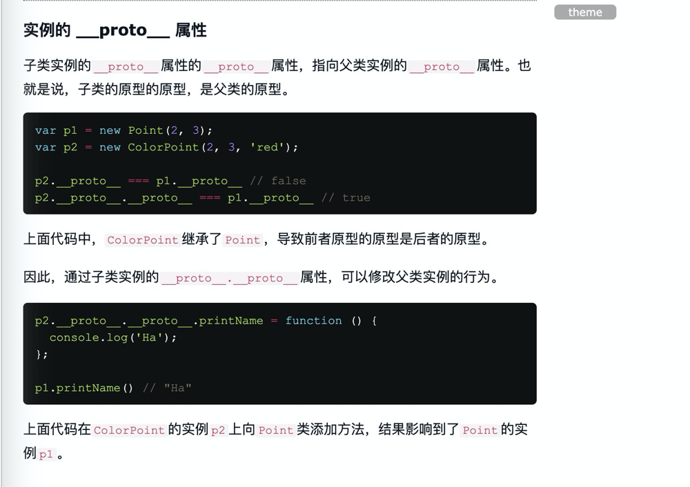

# 源码认识
- class类
   - 一篇彻底理解，串联这些枯燥又易混淆的概念`原型链(原型对象，各种指针，实例，构造函数之间的关系，其实就是一种对象间的赋值关系，就想平常自己写的那样)与堆栈及应用`，比如call, new,源码，插件中的应用（确定this指向），需要改变这个就改变哪个的时候，用到原型链重新赋值
   - 基本语法
        - 静态方法
        - 实例属性的新写法
        - 静态属性
        - 私有方法和私有属性
        - new.target属性
   - 继承
      - Object.getPrototypeOf()
      - constructor，supur
      - 类的 prototype 属性和__proto__属性
      - 实例的 __proto__ 属性
         - 子类实例的__proto__属性的__proto__属性，指向父类实例的__proto__属性。也就是说，子类的原型的原型，是父类的原型
         - 应用，结果：`因此，通过子类实例的__proto__.__proto__属性，可以修改父类实例的行为。`, 这样改变类子类的这个就同步改变类父类的那个（对象在堆中存放的指针）
      - 原生构造函数的继承
         - 以前，这些原生构造函数是无法继承的，比如，不能自己定义一个Array的子类。
         - ES5 是先新建子类的实例对象this，再将父类的属性添加到子类上，由于父类的内部属性无法获取，导致无法继承原生的构造函数
         - ES6 允许继承原生构造函数定义子类，因为 ES6 是先新建父类的实例对象this，然后再用子类的构造函数修饰this，使得父类的所有行为都可以继承
         - extends关键字不仅可以用来继承类，还可以用来继承原生的构造函数。因此可以在原生数据结构的基础上，定义自己的数据结构
      - Mixin 模式的实现
         - Mixin 指的是多个对象合成一个新的对象，新对象具有各个组成成员的接口
      
- Es6 class constructor实现
   - constructor方法默认返回实例对象（即this），完全可以指定返回另外一个对象
   ```js
    class Foo {
        constructor() {
            return {
                name: '新对象' // 若是返回基本数据类型.数字 instanceof还是返回true
            }
        }
    }
   // 判断谁是谁的实例
   // new Foo() instanceof Foo   // true
   new Foo() instanceof Foo // false
   ```
   - 类的所有方法都定义在类的prototype属性上面。
   ```js
    Point.prototype = {
        constructor() {},
        toString() {},
        toValue() {},
    };
   ```
   - es6类，完全可以看作构造函数的另一种写法`Point === Point.prototype.constructor // true`
    ```js
    function Ani() {

    }
    class Ani {

    }
    ```
    - super 既可以当做函数使用，也可以当做对象使用
- 类组件继承实现
- super
```js
class A {}

class B extends A {
  constructor() {
    super();
  }
}
```
注意，super虽然代表了父类A的构造函数，但是返回的是子类B的实例，即super内部的this指的是B的实例，因此`super()在这里相当于A.prototype.constructor.call(this)`。
   - new的时候class中的constructor会立即执行
```js
class A {
  constructor() {
    this.p = 2; // 实例上的
  }
}
class B extends A {
  get m() {
    return super.p;
  }
}

let b = new B();
b.m // undefined
这里需要注意，由于`super指向父类的原型对象`，所以定义在父类实例上的方法或属性，是无法通过super调用的。
上面代码中，p是父类A实例的属性，super.p就引用不到它
```
## redux
- 40：10
- combineReducers

### createStore()
实现原理
```js

```

### bindActionCreators()
实现原理
```js

```

### combinReducers()
实现原理
```js

```

### Provider()
供应商，提供者
```js

```
### connect()
```js
export default function(mapStateToProps, mapDispatchToProps) {
  return function(OldComponent) {
    return function(props) {
      let content = useContent()
    }
  } 
}
```
## 中间件
本质就是函数劫持，函数切片，重写dispatch方法：加入执行dispatch方法，之前，之后处理逻辑，或延迟处理
### 日志中间件