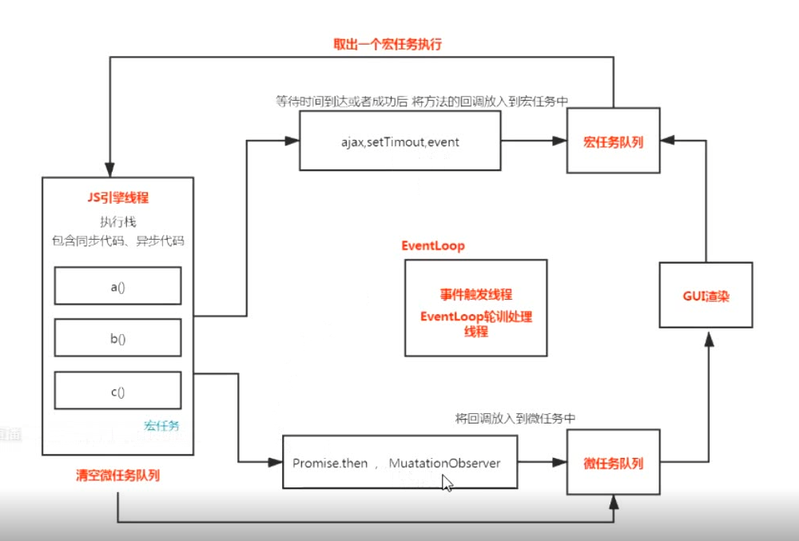
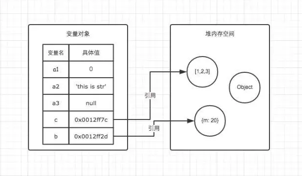
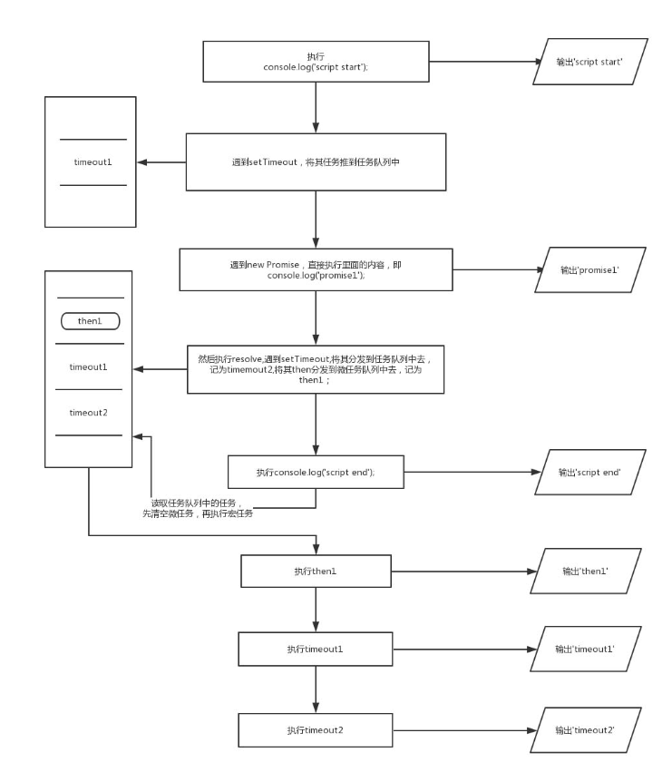
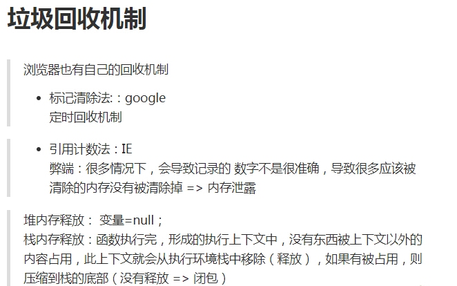

## 概念介绍

- <script>脚本一执行就进入js引擎线程（宏任务）
- 编译
- 解释
- 执行
## 渲染进程（浏览器内核）
>进程是系统进行资源分配和调度的一个独立单位 一个进程内包含多个线程
- GUI 渲染线程(页面渲染 css)
- js引擎线程(执行js脚本) 
- js中事件(onclick), 定时器(setTimeout)，ajax 会单独开一个线程
- 事件触发线程(EventLoop轮询处理) **去宏任务队列里面查找 看是否有到时间的**
> - js主线程(引擎线程)是单线程的
> - GUI 渲染线程 与 js引擎线程是互斥的 js执行的时候不会页面渲染  页面渲染的时候不会执行js脚本
> - js引擎线程执行完(同步，异步代码)之后被立即执行的叫微任务，同步异步代码执行完后去清空微任务
## 数据类型
- 基本数据类型（值类型number, string, blooen, null, undefind）
   - Synml() 唯一值
   - number(1, 0.2, NaN，infi无线)  typeof NaN -> "number"
      - NaN === NaN 和谁都不相等 isNaN() 判断 其他数据不能正常转化为number时 出现NaN Number('12px') -> NaN
   - null 的作用使变量指向空指针 释放堆内存
- 引用数据类型
   1. object: {} 普通对象 [] new Array /^$/ 正则对象 new Date() Math 实例对象... (一些类的实例 -> 实例对象 - 数组对象，日期对象... )
      - 数据类型typeof为小写"object", 构造函数为大写Object
      - 对象的属性名 可以为基本数据类型的各个值，属性名为引用类型值默认回转化成字符串处理 
      - {x:10}.toString() => "[object object]"   Object.prototype.toString()  原型链 数据类型转化
      - [].toString() => ""   Array.prototype.toString()
      - 数组是特殊的对象 有length 属性名为递增的代表位置的数字
      - dir(Array) Mdn
   2. function 特殊对象（附属），更多性质还是函数，有很多（js底层）的概念
   3. Symbol 唯一值
## v8引擎渲染机制
> 依次进入队列执行
- [过程](https://segmentfault.com/a/1190000011858383)
- 堆(heap)栈(stack)内存
   - 栈：1执行环境，2存储基本类型
   - 堆：存储引用类型么
- 定义
   - 堆heap则是动态分配的内存，大小不定也不会自动释放（引用数据类型: 数组 对象）
   - 栈stack为自动分配的内存空间，它由系统自动释放；（原始数据类型）
- 关系
   - 引用数据类型存放在堆里，=：传址
   - 基本数据类型存放在栈里，=：直接传值
   - 
- 代码解析过程 
   > 词法解析 => AST语法树 => js引擎 => 执行栈 => 全局对象(变量提升) => 运行
   - 编译器（）
      1. 词法解析
      2. AST抽象语法树
      3. 构建出浏览器能够执行的代码
   - 引擎（v8 / webkit内核）浏览器识别代码
      - ECStack(`执行环境栈`) / 栈内存 作用：(也是环境，也是存储基本数据类型) 执行代码
      - EC 执行环境(`执行上下文`) 某个域下的代码执行都有自己的上下文
         - 全局 EC(G) global 全局
         - 函数 EC(...) 私有的
         - 进栈执行-(压缩到栈里进行)-进栈 有的没有用的执行完-出栈 有的还有用的回压缩到栈底-`闭包`(等待下次调用)
            - GO(全局对象)
               - 变量赋值三步 
                  1. 创建变量(lrh,左侧词法解析) - 声明
                  2. 创建值：基本值直接在栈中创建和存储
                  3. 赋值 让变量和值关联起来 - `定义defined`
            - 堆栈内存
               - 栈：
      1. 变量提升
      2. 作用域 / 闭包
      3. 变量对象
      4. 堆栈内存
      5. /VO/AO/

## 编译
- 编译型语言
> 比如先把中文稿 翻译一份英文稿 给外国人 然后演讲 => 编译后直接运行
- 解释型语言
> 演讲中，同声翻译，演讲一句，翻译一句 =>  
- js 为预编译 先提升所有定义变量var 为undifine 和 function

## 词法分析
- 编译顺序
- 执行顺序
- 作用域
- 运行机制
函数的作用域在定义的时候就决定了，和在哪里执行没有关系，这就是词法作用域

## 执行上下文
- 全局对象
- 局部变量
- 深入理解 各种运行环境 上下文界定
- javaScript在浏览器中运行的过程分为两个阶段预解析阶段 执行阶段, 所谓javascript预解析正是创建函数的执行环境(又称“执行上下文”)，只有搞定了javascript的执行环境我们才能搞清楚一段代码在执行过后为什么产生这样的结果。
## 作用域 与 作用域链
- 函数定义的时候就产生作用域 ， 执行的时候产生执行上下文
- 与执行上下文的不同
## this指代
- 指的是 调用函数的那个对象[更多](https://www.jianshu.com/p/f2cdbd345211) `需是哪个对象调用 指代的是这个对象`，`若返回的是函数，this指代window`
```js
var o = {
    text: 'hello',
    arr: ['join', 'agoh'],
    fn: function () {
       return function aa() {
          console.log(this, 'sdfsdfsdfsd') // window
       }
    }
}
o.fn()()
```
- this指针 - 当前类的实例 - 向上查找
- 比如当通过某个对象来调用函数时，该对象就是此次调用的上下文，也就是改函数的 this 的值
```js
var o = {
    text: 'hello',
    arr: ['join', 'agoh'],
    fn: function () {
       console.log(this) // o 调用fn this指代o对象
       let that = this
        this.arr.forEach(function (item) { // 或将此函数改为箭头函数 原因：箭头函数本身没有this, 会指向上级作用域this
            console.log(this.text, '标志') // 获取不到this 改为that 变量接受 原因：变量会向上级作用域查找
            console.log(that.text, '标志')
        })
            // 相当于 return undefind
        // let abb = {
        //     a: 1,
        //     b: 2,
        //     cc: function bb() {
        //         console.log(this, 'sdfsdfsdfsd')
        //         return 1
        //     }
        // }
        // return abb
    }
}
var pp = o.fn()
console.log(pp) // undefind
```
## 闭包
- mdn定义
> 闭包是指那些能够访问自由变量的函数
- 自由变量？
自由变量是指在函数中使用的，但既不是函数参数也不是函数的局部变量的变量。
> 闭包 = 函数 + 函数能够访问的自由变量
```js
var a = 1;

function foo() {
    console.log(a);
}

foo();
```
定义：foo 函数可以访问变量 a，但是 a 既不是 foo 函数的局部变量，也不是 foo 函数的参数，所以 a 就是自由变量。

那么，函数 foo + foo 函数访问的自由变量 a 不就是构成了一个闭包嘛……

所以在《JavaScript权威指南》中就讲到：从技术的角度讲，所有的JavaScript函数都是闭包。

咦，这怎么跟我们平时看到的讲到的闭包不一样呢！？

别着急，这是理论上的闭包，其实还有一个实践角度上的闭包，让我们看看汤姆大叔翻译的关于闭包的文章中的定义：

ECMAScript中，闭包指的是：

从理论角度：所有的函数。因为它们都在创建的时候就将上层上下文的数据保存起来了。哪怕是简单的全局变量也是如此，因为函数中访问全局变量就相当于是在访问自由变量，这个时候使用最外层的作用域。
从实践角度：以下函数才算是闭包：
即使创建它的上下文已经销毁，它仍然存在（比如，内部函数从父函数中返回）
在代码中引用了自由变量
接下来就来讲讲实践上的闭包


- 产生：执行环境栈中有未被执行（未销毁）的任务（代码）
- 应用：
   - 定时器
   - 柯里化 封装检查数据类型
- 俗语：其实就是一种约定（这样写就叫做闭包，可实现一些功能）
- 理解（定义.概念）：
   - 总结：当前这个函数(-1)可以不在当前作用域下(11)调用(除开window下)
      - 函数返回函数 如果都执行完了 就不叫闭包
      ```js
      function checkType(type) {
         // 11
         return function-1(value) { // 'Sting' 被保存到了这里 函数没有执行就不会销毁   闭包
            return Object.prototype.toString.call(value) === `[object ${type}]`
         }
      }
      checkType()()
      ```
   - js高程中描述：闭包是指有权访问另一个函数作用域中的变量的函数。
   - 权威指南中描述：从技术的角度讲，所有的JavaScript函数都是闭包：它们都是对象，它们都关联到作用域链
   - 你不知道的JavaScript中描述：**当函数可以记住并访问所在的词法作用域时，就产生了闭包，即使函数是在当前词法作用域之外执行**
   ```js
      function fn1() {
         var name = 'iceman';
         function fn2() {
            console.log(name);
         }
         fn2();
      }
      fn1();
      上面的代码已经产生闭包了。fn2访问到了fn1的变量，满足了条件“有权访问另一个函数作用域中的变量的函数”，fn2本身是个函数，所以满足了条件“所有的JavaScript函数都是闭包”。
      这的确是闭包，但是这种方式定义的闭包不太好观察。
      ========================================
      function fn1() {
         var name = 'iceman';
         function fn2() {
            console.log(name);
         }
         return fn2;
      }
      var fn3 = fn1();
      fn3();
      1.fn2的词法作用域能访问fn1的作用域
      2.将fn2当做一个值返回
      3.fn1执行后，将fn2的引用赋值给fn3
      4.执行fn3，输出了变量name
      我们知道通过引用的关系，fn3就是fn2函数本身。执行fn3能正常输出name，这不就是fn2能记住并访问它所在的词法作用域，而且fn2函数的运行还是在当前词法作用域之外了。
      ========================================
      function waitSomeTime(msg, time) {
         setTimeout(function () {
            console.log(msg)
         }, time);
      }
      waitSomeTime('hello', 1000);
      定时器中有一个匿名函数，该匿名函数就有涵盖waitSomeTime函数作用域的闭包，因此当1秒之后，该匿名函数能输出msg。
      ========================================
      for (var i = 1; i <= 10; i++) {
         setTimeout(function () {
            console.log(i);
         }, 1000);
      }
      for循环中使用定时器延迟打印的问题
      我们对其的预期是输出1~10，但却输出10次11。这是因为setTimeout中的匿名函数执行的时候，for循环都已经结束了，for循环结束的条件是i大于10，所以当然是输出10次11咯。
      究其原因：i是声明在全局作用中的，定时器中的匿名函数也是执行在全局作用域中，那当然是每次都输出11了
      原因知道了，解决起来就简单了，我们可以让i在每次迭代的时候，都产生一个私有的作用域，在这个私有的作用域中保存当前i的值
      for (var i = 1; i <= 10; i++) {
         (function () {
            var j = i;
            setTimeout(function () {
                  console.log(j);
            }, 1000);
         })();
      }
      或者
      将每次迭代的i作为实参传递给自执行函数，自执行函数中用变量去接收：
      for (var i = 1; i <= 10; i++) {
         (function (j) {
            setTimeout(function () {
                  console.log(j);
            }, 1000);
         })(i);
      }
   ```
- [解释](https://www.jianshu.com/p/85add291c8a5)
- 应用：典型是定义模块，我们将操作函数暴露给外部，而细节隐藏在模块内部
   ```js
      function module() {
         var arr = [];
         function add(val) {
            if (typeof val == 'number') {
                  arr.push(val);
            }
         }
         function get(index) {
            if (index < arr.length) {
                  return arr[index]
            } else {
            return null;
            }
         }
         return {
            add: add,
            get: get
         }
      }
      var mod1 = module();
      mod1.add(1);
      mod1.add(2);
      mod1.add('xxx');
      console.log(mod1.get(2));
   ```
## 原型链
- 名词：原型对象，实例对象（就是new 构造函数的接受变量），函数对象（函数对象我们可以简单的理解为函数，因为在js中函数本身就属于一个对象），constructor, prototype, proto, __proto__, 原型继承 
- 原型对象我们可以简单的理解为原型对象是实例对象和函数对象的父对象，俗称：爸爸，并且通过实例对象和函数对象都能找到原型对象；[更多](https://www.cnblogs.com/dengyao-blogs/p/11481326.html)
- 实例对象和函数对象的关系
```js
function People(name){
   this.name=name;
   console.log(this.name);
}
var student = new People("张三");
People是构造函数，student是实例对象，二者之间的关系体现在constructor属性中；
student.constructor === People; //true
student instanceof People  //true
```
- new关键字做了什么？
构造函数和普通函数在JS中没有什么太大的区别，所以我们可以想到那么直接使用函数的话，this的指向肯定是浏览器全局对象window，那么我们new一下之后，this的指向将会改变为新的实例对象，并且还会将这个新的实例对象返回回来；
所以我们可以总结new做了什么：
1. 新建了一个空的函数对象；
2. 改变this的指向，将this的指向改为接收新函数对象的实例对象
3. 返回这个新的实例对象
4. 一 new 构造函数就会执行 与 class constructor 中的语句一样 可
```js
function Per() {
   id.innerText = '改变节点'
   id.appendChild = frame // 塞回文档碎片
}
``` 
- 讨论
   1. 原型链主要用于继承，其实就是为了代码复用。因为js算不上是面向对象的语言，继承是`基于原型实现而不是基于类实现的`，所以继承的思想体现的不是特别深
- 总结
1. `实例对象.__proto__指针` 等于 `构造函数的prototype` 等于 `原型对象` 
2. 对象(普通对象，实例对象，原型对象，普通函数，构造函数)就具有__proto__指针
3. 只有`原型对象`, `实例对象`, `普通对象`具有`constructor`指向它的构造函数
4. 只有`构造函数`, `普通函数`具有`prototype`指向它的原型对象
5. 示例
   - prototype: '原型对象'
   ```js
      [].__proto__ = Array.prototype = { // 原型对象
         isArray: f,
         constructor: '构造函数Array',
         concat,splice,push,freeze, toString等数组方法,
         __proto__: '原型对象Object'
      }
   ```
   - Array.__proto__
   ```js
      Array.__proto__ = {
         constructor: f Function'构造函数Function'
         arguments, apply, bind, call, toString等方法
         __proto__: { // 'Object的原型对象'
            hasOwnProperty: ,
            toString: ,
            valueOf: ,
            constructor: { // Object的构造函数
               assign: f,
               create: f,
               defineProperty: f,
               freeze: f, // 冻结对象
               keys: f, 等对象方法
            }
         }
      }
   ```
## EventLoop 事件循环机制
   - 概念：js引擎为主线程
   - 应用
   - 宏任务: `setTimeout, ajax`
   - 微任务: `Promise`
      - new MutationObserver() // nextTick 原理 多次调用nextTick 都保存在一个数组，队列里面 循环全部执行 Promise then里面 
   - 先执行同步代码，再执行promise then中的微任务， 再执行 宏任务
   - 
   ```js
      console.log('script start');
      setTimeout(function() {
      console.log('setTimeout');
      }, 0);

      Promise.resolve().then(function() {
      console.log('promise1');
      }).then(function() {
      console.log('promise2');
      });

      console.log('script end');
      // script start, script end, promise1, promise2, setTimeout
   ```
   ```js
      console.log('script start');
      setTimeout(function() {
      console.log('timeout1');
      }, 10);

      new Promise(resolve => {
         console.log('promise1');
         resolve();
         setTimeout(() => console.log('timeout2'), 10);
      }).then(function() {
         console.log('then1')
      })
      console.log('script end');
      // script start, promise1, script end, then1, timeout1, timeout2
   ```
## 垃圾回收机制

- for 的运行机制
   - for循环还有一个特别之处，就是设置循环变量的那部分是一个父作用域，而循环体内部是一个单独的子作用域
   ```js
   for (let i = 0; i < 3; i++) {
   let i = 'abc';
   console.log(i);
   }
   // abc
   // abc
   // abc
   ```
   > 上面代码正确运行，输出了 3 次abc。这表明函数内部的变量i与循环变量i不在同一个作用域，有各自单独的作用域。
## 规范
- AMD
   - 用于浏览器
   - 运行时
- Commonjs(模块)规范
> NodeJs 基于Commonjs规范
   - 用于服务器
   - module.exports 导出
   - require 导入
   - 运行时加载
   ```js
   let { stat, exists, readFile } = require('fs');

   // 等同于
   let _fs = require('fs');
   let stat = _fs.stat;
   let exists = _fs.exists;
   let readfile = _fs.readfile;
   ```
- Es6(模块) 规范
   - 用于浏览器
   - export 
   - import
   - 编译时加载(静态加载)
   ```js
   import { stat, exists, readFile } from 'fs';
   ```
   > 上面代码的实质是从fs模块加载 3 个方法，其他方法不加载。这种加载称为“编译时加载”或者静态加载，即 ES6 可以在编译时就完成模块加载，效率要比 CommonJS 模块的加载方式高。当然，这也导致了没法引用 ES6 模块本身，因为它不是对象
## Es6 新
### 易忘
   - 暂时性死区
      - 总之，在代码块内，使用let命令声明变量之前，该变量都是不可用的。这在语法上，称为“暂时性死区”（temporal dead zone，简称 TDZ）
      - ES6 明确规定，如果区块中存在let和const命令，这个区块对这些命令声明的变量，从一开始就形成了封闭作用域。凡是在声明之前就使用这些变量，就会报错。
      ```js
         var tmp = 123;
         if (true) {
            tmp = 'abc'; // ReferenceError  即使是在全局声明了tem 但这儿在 let 之前使用 也会报错 明确规定 暂时性死区
            let tmp;
         }
      ```
   - let var 在for中的区别
   - 剩余运算符 `...`
      - 函数新增
   - 扩展运算符 `...`
      - 对象新增
   - 箭头函数与变量解构结合使用`vuex中 ({commit})`
   ```js
      let person = { // 预期
         first: '',
         last: ''
      }
      const full = ({ first, last }) => first + ' ' + last;

      // 等同于
      function full(person) {
         return person.first + ' ' + person.last;
      }
   ```
   - export var a = 1 与 export default {}
   ```js
      export var a = 1
      export function b() {}
      var a = 1
      function b() {}
      export {
         a,
         b
      }
      import {a} from ''
      // a -> 1
      // ===============
      export default var a = 1
      或
      var a = 1
      function b() {}
      export default {
         a,
         b
      }
      import obj from ''
      // obj.a -> 1
   ```
   > export 可以写多个 export default 只能写一个
### promise
> 基于高阶函数，发布订阅模式
- 问题？？
   - 如果先.catch 会进入then吗
1. then中回调push
2. new Error() 进入reject
3. 如果then成功或失败的结果中，返回的还是一个promise,会等待这个promise的执行结果，并将结果传递到下一个then的参数中
4. 第一个then(成功方法, 失败方法)，走下一个then的失败有两种情况
   - 返回一个失败的promise
   - 抛出异常
   ```js
      read('./name.text', 'utf8').then((data) => {
         // return read('./name1.text这儿没有这个文件', 'utf8') 失败结果 -> 地点2
         // throw new Error('123') -> 地点2
         // (这儿不写  相当于 return undefined) 进入下一个then的成功 -> 地点1
         // return 111 普通值 -> 地点1
      }, (err) => {
         // (这儿不写  相当于 return undefined) 进入下一个then的成功 -> 地点1
         // throw err -> 地点2
          return new Promise(() => {}) 不成功也不失败 就不会进入下一个then 中断了
      }).then((data) => {
         // 地点1
      }, (err) => {
         // 地点2
      })
   ```
5. 走完失败 终止promise
6. 链式调用
   - let p = new Promise() Promise的实例p的状态一旦确定了就不会改变
   - 为什么返回的不是this(同一个实例), 因为如果失败了 它的状态就不会改变 这个this就一直都是失败的
   - 每次调用promise都需要返回一个新的promise实例(状态) 保证状态不影响
- 高阶函数
   - 一个函数的参数为函数， 返回值为函数
   - 核心逻辑提取出来， 可扩展其他功能
   ```js
   // 装饰模式（在什么之前后，又做点什么，叫装饰） AOP 切片
   Function.prototype.before = function(cb) {
      console.log(this)
      // 剩余运算符
      return (...args) => { // 箭头函数中没有this this会向上一层查找, 箭头函数中没有arguments
         cb();
         this(...args) // 展开运算符
         //this.apply(null, args)
      }
   }
   function makeCoffee(name) {
      console.log('核心功能 创建一倍咖啡'+ name)
   }
   let newFunc = makeCoffee.before(function() {
      console.log('加糖')
   })
   newFunc('参数1', '参数2')
   ```
- 柯里化
   - 把核心功能，提出一个更细小的函数
   - 不停的细化函数，每次调用返回一个函数 ！！！
   - 校验类型
   - 普通函数每次都需要传递参数，可以用高阶函数来绑定参数
   ```js
   // 把String 保存到isString方法里
   function checkType(type) {
      return function(value) { // 'Sting' 被保存到了这里 函数没有执行就不会销毁   闭包
         return Object.prototype.toString.call(value) === `[object ${type}]`
      }
   }
   let isString = checkType('Sting')
   console.log(isString('hello')) 
   ```
- callback
   - 解决异步并发的问题靠的就是计数器 - 有全局变量
- 发布订阅模式
   - evebtBus  先存起来 依次触发
   - 可以解耦合
   - 两者无关系
- 观察者模式
   - 需把观察者挂载到被观察者上
> 发布订阅与观察者模式的区别：
> - 观察者基于发布订阅
> - 观察者两者有关系
- promise
   - 返回的是一个promise实例 能一直链式调用then
   - new一个Promise中的executor是立即执行的`立即执行11`
   - 一旦成功就不会失败 反之亦然
   ```js
      new Promse(() => {
         throw new Error('错误') // 如果内部出错了 就会变成失败态
         console.log(11)
         resove('成功') // 前面状态改变了 这儿就不会执行
      })
      console.log(22)
      // 11 22
   ```
## 跨域
- 为什么会跨域
   - 原因：协议、端口、和域名有任意一个不同就会造成跨域
- 解决跨域的原理是什么
- 浏览器同源策略
- 九种方式
1. http地址跨域
2. jsonp
3. proxy
4. 浏览器非安全模式打开，去除访问限制Lax

## 浏览器错误表现
- core-fail
可能服务端未启动  巡检系统dev
- xxx
请求库不支持跨域
- xxx
请求未发出
