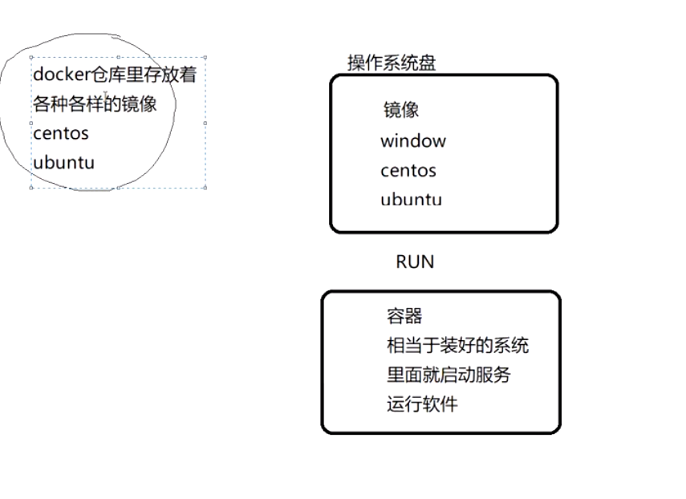

# 向上
## 数据结构
- 栈
> 先进后出
   - ast语法解析
   - 怎么解析html片段 生成语法树?
- 队列
> 先进先出
- 数组
- 链表
- 集合
- hash表
- 树
## 算法
### 排序
- 冒泡
> 依次向右查找<br>
> O(n) 方 复杂度很大
- 二分
- LRP
## 服务端渲染
- 静态化和服务端渲染是两个概念：静态化是说你把页面用nuxt之类的弄成html页面，里面的文本内容都在html里填充好了，是在你打包的时候就填充的，请求的就是静态文件；服务端渲染===ssr，并不等于静态化，是在服务端，在你请求的时候把html里动态填充上内容才返回给你的，并不是在你打包的时候填充的
## 微前端
- 技术细节
   - 样式隔离
   - window 沙箱
   - 通信机制（应用之间如何互相通信）
- singleSpa
   - 主应用
   - 子应用
- qiankun
- 沙箱
- 方案
   - iframe
   - web-component
      - web component 是浏览器自带的一套 runtime，它提供 shadow dom，能够完全隔离 css
- 讨论
   - 抛出一个疑问，微前端究竟是为了"微"还是兼容不同框架？这两者有本质不同，如果只是为了"微"，那么各种隔离都不需要做，因为本质上就是把大项目拆分，本身他们之间就不会有任何影响。而只是兼容不同框架，那么这个意义不大，谁会在一个公司为了用不同的框架从而维护好几套 ui 框架 [看看你] 不觉得累么。除非就是拿微前端来填坑，把旧的东西很难重构的页面杂糅在一起，而这个本质上已经偏离了真正微前端的意义了
   - 微组件挺好，我就一个 WebCompoent，你不用管我用 R/V/A/j，反正给你的就是一个 js 和一个 tag，你自己调用就行了。所以一个页面充满着 R/V/A/j 问题也不大。就和 Docker 一样，data 进来了，我给你 trans 出 你想要的 data 就行啦，至于怎么实现的，用什么技术实现的，对不起，这不重要，我也不想关心，调用就完了
   - 就是主应用加载子应用js文件
## 模版引擎实现原理
## web安全
## 网络协议
- [文章](https://www.cnblogs.com/Java3y/p/8444033.html)
- TCP握手协议(http)
- 状态码具体含义
## 网络
浏览器如何解析js  清晰网络请求控制台各项表示 红蓝条 - 网络请求时间 - 本地渲染时间  / 对象实例化后的作用，流程结果及渲染到浏览器
- http和https的区别？
   - https：是以安全为目标的HTTP通道，简单讲是HTTP的安全版本，通过SSL加密。
   - http：超文本传输协议。是一个客服端和服务器端请求和应答的标准（tcp）,使浏览器更加高效，使网络传输减少
- 输入Url到网页加载完成的过程？
```js
dns解析 =》 连接tcp协议（3次握手） =》 浏览器请求服务器返回空html =》 浏览器渲染dom,css 发起ajax 请求服务器数据 =》 服务器返回数据填充Dom =》 断开连接（4次挥手）
```
- axios
   - 有些情况需要创建多个axios 实例 可以进行不同配置（因为我们实际工作项目中，可能需要访问多个服务地址，而这些服务请求和响应的结构也可能都完全不同，那么你可以通过axios.create创建不同的实例来处理。） [地址](https://www.jianshu.com/p/636aa0e565a5)
   - 实例可以直接调用方法, 可以传参 构造函数调用静态方法   理解axios 默认会返回一个实例
   - 键值对数据传递模式 axios.defaults.headers.post['Content-Type'] = 'application/x-www-form-urlencoded';
   - json数据传递模式 axios.defaults.headers.post['Content-Type'] = 'application/json'
### 区别
- post请求 页面刷新不会保留，量大，安全
- get 页面刷新 会缓存？，量小，不安全
- delete
- 等等

### 存储区别
- cookit
- sesstion

### 跨域处理
九种跨域实现
1. http地址跨域
2. jsonp
3. proxy

### 接口请求
- General
- Response Headers
- Request Headers
- 参数方式
   - Post方式：Request Payload （data参数为new FormData() / new URLSearchParams()）
   - Get方式：
      - Form Data  （地址栏有参数，data参数为json格式）
      - Query String Parameters (地址栏有参数，data没有携带参数)
### http 协议
- 原理 / 理解
- 网络数据请求流程，安全证书
> 转到进阶网络协议
## 进阶
- let 和 var 的存储地址不同
- 函数式编程
   1. 柯里化(curry函数应用参数列表的顺序是从左到最右)
   2. 偏函数(partial函数应用参数列表的顺序是从左到最右)
### 组件库
- http://gitlab.shishike.com/front_end/kryfe-components
- http://gitlab.shishike.com/front_end/kryfe-component-ts
- 通用库：kryfe-lib
### 构建工具(cli)
-  http://gitlab.shishike.com/front_end/kryfe-tools
### 代码检查工具
- http://gitlab.shishike.com/front_end/stylelint-config-kryfe
- http://gitlab.shishike.com/front_end/eslint-config-kryfe
- http://gitlab.shishike.com/front_end/kryfe-style-mobile
### docker
- http://gitlab.shishike.com/front_end/kryfe-nginx-docker
## 浏览器
### 缓存优化
> 304
- [缓存机制](https://www.jianshu.com/p/54cc04190252) 百度：浏览器的缓存机制
- 强制缓存
- 协商缓存
### 垃圾回收机制原理（v8引擎）
- 如何实现的垃圾回收
### 浏览器是如何渲染的（渲染原理）
- [原理](https://www.jianshu.com/p/8fd2311546f8)
- 输入地址亲求服务器 服务器返回html文件
- 开始载入全部的html代码，发现标签内有一个标签引用外部CSS文件，浏览器又发出CSS文件的请求，服务器返回这个CSS文件；
- 回流，重绘
### 前端项目是如何运行的
- HTML,CSS,JS都是在浏览器中渲染执行的，确切的说是浏览器内核做的事情，渲染引擎和JavaScript执行引擎。
- 如果是现代vue，react等框架，一般都会使用webpack构建工具，它会做一些处理例如css预处理器的解析、css前缀补全、es6+新语法向老语法的转换等等操作，都是在本地nodejs环境执行的，编译打包过后方可在浏览器端执行。

## 敏捷开发
- 流程
- 特点
   - 尽早交付，从用户反馈，迭代更新
## 前端SDK
> 完善的SDK叫做框架-[文章](https://www.zhihu.com/question/20225153)
- 优惠券计算SDK
## 前端监控
> 更好服务产品
- 性能
   - DNS查询时间
   - TCP链接时间
   - request请求时间
   - 白屏时间
   - 首屏时间
   - 可交互时间
   - 总下载时间
   - dom下载时间
- 错误
> 更好地及时发现，定位错误
   - js错误
   - 用户信息
   - api请求地址
   - 分辨率
   - json错误
- 用户行为
## 爬虫

## 工程化.运维 (jenkins配置)
- 配置短命令
   ```
   vi ~/gitconfig
   [alias]
      a = add -A
      c = commit -m "init"
      p = push origin master 
   ```
- CI(持续集成)CD持续部署
- docker
   - Docker属于Linux容器的一种封装，提供简单易用的容器使用接口
   - Docker将应用程序与该程序的依赖，打包在一个文件里面，运行这个文件就会生成一个`虚拟容器` 程序在这个虚拟容器里运行，就好像在真实的物理机上运行一样
      - Docker比虚拟机更加轻量级 性能更高 centos(虚拟机4-5G) docker 40-50M
      
- 开始 创建3个github项目
   > 前端，服务端项目提交会向 webhook 链接的服务器（http://39.106.107:3000/webhook ）发送请求，webhook服务器 docker部署
   - 前端项目（配置webhook 密钥 请求方式 连接的服务器等，比如http://39.106.107:3000/webhook）
   - 服务端项目（配置webhook 密钥 请求方式 连接的服务器等，比如http://39.106.107:3000/webhook）
   - webhook项目(CICD服务器)
      - webhook.js中 创建服务 // 上面配置的 这儿监听3000端口
         - 判断 路劲是不是 上面配置的`/webhook`
      - 提交前后端项目 这儿就会收到请求
- 操作Xshell（在Xshell中）
   - 下载 git
   - 下载前端(vue-front) 服务端(vue-back)项目(生成公钥 免输密码)
      - git clone ...项目
      - ssh-keygen -t rsa -b ...（免密）
      - cat 查找文件 查看生成公钥（Xshell内容）
   - 下载node(nvm 管理node 可以存在多个node版本)
      - nvm install stable 同时安装node npm
      - npm install nrm -g (切换安装源)
      - 开放阿里云接口
   - 安装docker
      - 安装阿里云镜像
   - 安装启动服务
      - cd vue-front/back 进入前端/服务端文件夹
      - npm i 安装依赖
      - npm start 启动项目
### [流程图](http://www.sohu.com/a/338934428_100299155)
编码 => 构建(build, 安装依赖等) => 测试 => 集成(分支测试通过，集成到主干) => 交付 => 部署

1. 编码到集成 叫做 持续集成
2. 编码到交付 叫做 持续交付
3. 编码到部署 叫做 持续部署

### webpack
### 自动化测试
### 自动化部署(一次)
   1. webHook
   2. Docker镜像 Nglix代理
### 持续集成（Continuous integration，简称 CI）
- 关键：(持续， 多次)[解释1](https://www.jianshu.com/p/c200884960ac) [解释2](https://www.jianshu.com/p/78e03a140125)
- 概念
>1、持续集成是一种软件开发实践，即团队开发成员经常集成他们的工作，通过每个成员每天至少集成一次，也就意味着每天可能会发生多次集成。每次集成都通过自动化的构建（包括编译，发布，自动化测试）来验证，从而尽早地发现集成错误。许多团队发现这种方法可以显著减少集成引起的问题，并可以加快团队合作软件开发的速度（以上引用自Martin Fowler 对持续集成的定义）。<br>
2、持续集成指的是，频繁地（一天多次）将代码集成到主干
- 为什么使用
时常我们会被集成折磨得焦头烂额。有很多团队只是担心，并没有拿出有效的措施去避免这种事情发生，以至于延长了交付时间。既然担心，我们何不及早集成，把问题先暴露出来？ 最后集成会出现很多问题，所以提前这样去把问题暴露出来
- 好处
>1、快速发现错误。每完成一点更新，就集成到主干，可以快速发现错误，定位错误也比较容易。<br>
2、防止分支大幅偏离主干。如果不是经常集成，主干又在不断更新，会导致以后集成的难度变大，甚至难以集成。<br>
3、减少风险<br>
4、减少重复过程

- 目的
>持续集成的目的，就是让产品可以快速迭代，同时还能保持高质量。它的核心措施是，代码集成到主干之前，必须通过自动化测试。只要有一个测试用例失败，就不能集成。
Martin Fowler 说过，”持续集成并不能消除 Bug，而是让它们非常容易发现和改正。”
- 工具
>GitHub 上比较主流的持续集成工具有 Travis CI 和 Circle CI；分别占市场占有率前两位，两者的功能和使用都比较相似，其中Travis CI用的最多
- 总结
   >1、持续突出的就是一个**快**字，商业软件的快速落地需求推动了软件工程的发展。可持续的、**快速迭代**的软件过程是当今主流开发规约。尤其在互联网行业，快速响应即是生命线。从一个想法到产品落地都处在冲锋的过程中，机会稍纵即逝。响应用户反馈也是万分**敏捷**，早晨的反馈在当天就会上线发布，快得让用户感觉倍受重视。“快”已经成为商业竞争力。这一切都要求企业具备快速响应的能力，这正是推动持续集成、持续交付、持续部署的动力<br>
   2、产品或者项目的参与者应该能够深刻体会到团队协作时，工作交接（系统集成）部分最容易出问题，会消耗大量的沟通成本与时间成本，直接拖慢进度。所以，一个行之有效的项目管理过程（包括沟通管理、流程管理）在大型项目中效果明显。当前**敏捷开发**是主流，持续集成、持续交付与持续部署正好能够帮助高效地实施敏捷过程，促进开发、运维和质量保障（QA）部门之间的沟通、协作与整合

#### CI&CD 带来的变化
目前多数公司都已经使用了版本管理工具来管理源码，比如GitLab、SVN 等版本管理工具。在版本管理这一块，公司会根据自己的实际情况来制订版本管理办法。对于持续集成来说，业内建议只维护一个源码仓库，降低版本管理的复杂度。开发人员**持续提交自己的修改，自动触发编译，自动集成，自动进行自动化的测试**，及早反馈集成过程中的问题，就能更好地防止出现平时不集成、集成就出问题的现象<br>
通过自动化的持续集成，把管理流程固化；保证集成的有序性、可靠性；减少版本发布的不合规性（开发或者测试手动打包，可能一天打多个包，更新多次，测试不充分），保证版本可控，问题可追溯（至于哪个版本出现的问题，可以回溯）。<br>

一旦把这种持续集成的过程固定下来，形成一个自动化过程，就具备了持续集成的能力，软件交付的可靠性就大大增强，这无形也是一种竞争力。这种竞争力保证了集成的有序性、可靠性。过程的自动化抛弃了人工，降低了出错率，提高了速度，自然会节省成本。

#### CI&CD 实施现状
在日常生活中处处都体现着一个“快”字，互联网更是对快追求到极致。持续集成、持续交付、持续部署在互联网行业更为广泛。作者没有统计哪些公司在用，只是圈子中朋友公司都实施了持续集成，具备持续交付能力。至于持续部署就没这么广泛了，毕竟**持续部署不仅仅是技术问题，还涉及管理、营运等问题**。尤其是一些金融企业、大型国企，开发团队外包，测试外包，运营半外包，安全要求高，很难快速实施。多数能够在测试环境中建立起CI&CD就已经很不错了。<br>

阿里云、腾讯云、网易蜂巢等国内云，都提供了从GitLab 下拉代码、编译打包、单元测试、镜像制作、容器发布的功能。这个过程实际上就是持续集成、持续交付的过程，同时具有持续部署的能力。基本上，持续集成、持续交付、持续部署是一种服务能力，是云平台必须具备的能力。

#### CI&CD 技术栈
目前持续集成、持续交付、持续部署在开源社区都是热点，用户可以方便地利用这些开源组件来构建自己企业的持续集成、持续交付及持续部署平台。<br>

持续集成工具中以Jenkins 使用最为广泛，由Jenkins 来作业化持续集成过程；利用GitLab来管理程序版本；利用Gerrit 来做代码审核；利用**Sonar 进行代码质量扫描**；利用JUnit 进行单元测试；利用Docker compose 来构建镜像；利用Docker 来部署容器；利用Kubernetes、Rancher 等进行服务编排。


### 持续交付
持续交付（Continuous delivery）指的是，频繁地将软件的新版本，交付给质量团队或者用户，以供评审。如果评审通过，代码就进入生产阶段。
持续交付可以看作持续集成的下一步。它强调的是，不管怎么更新，软件是随时随地可以交付的。
### 持续部署
- 持续部署（continuous deployment）是持续交付的下一步，指的是代码通过评审以后，自动部署到生产环境。
- 持续部署的目标是，代码在任何时刻都是可部署的，可以进入生产阶段。
- 持续部署的前提是能自动化完成测试、构建、部署等步骤
- 流程
1. 提交代码(commit)
流程的第一步，是开发者向代码仓库提交代码。所有后面的步骤都始于本地代码的一次提交（commit）。
2. 测试(第一轮)
   - 代码仓库对 commit 操作配置了钩子（hook），只要提交代码或者合并进主干，就会跑自动化测试。
   - 测试有好几种。
   1. 单元测试：针对函数或模块的测试
   2. 集成测试：针对整体产品的某个功能的测试，又称功能测试
   3. 端对端测试：从用户界面直达数据库的全链路测试
第一轮至少要跑单元测试。
3. 构建
>通过第一轮测试，代码就可以合并进主干，就算可以交付了。
交付后，就先进行构建（build），再进入第二轮测试。所谓构建，指的是将源码转换为可以运行的实际代码，比如安装依赖，配置各种资源（样式表、JS 脚本、图片）等等。
常用的构建工具如下。
   - Jenkins
   - Travis
   - Codeship
   - Strider
> Jenkins 和 Strider 是开源软件，Travis 和 Codeship 对于开源项目可以免费使用。它们都会将构建和测试，在一次运行中执行完成
4. 测试(第二轮)
>构建完成，就要进行第二轮测试。如果第一轮已经涵盖了所有测试内容，第二轮可以省略，当然，这时构建步骤也要移到第一轮测试前面。
第二轮是全面测试，单元测试和集成测试都会跑，有条件的话，也要做端对端测试。所有测试以自动化为主，少数无法自动化的测试用例，就要人工跑。
需要强调的是，新版本的每一个更新点都必须测试到。如果测试的覆盖率不高，进入后面的部署阶段后，很可能会出现严重的问题。
5. 部署
>通过了第二轮测试，当前代码就是一个可以直接部署的版本（artifact）。将这个版本的所有文件打包（ tar filename.tar * ）存档，发到生产服务器。
生产服务器将打包文件，解包成本地的一个目录，再将运行路径的符号链接（symlink）指向这个目录，然后重新启动应用。这方面的部署工具有 Ansible，Chef，Puppet 等。
6. 回滚
>一旦当前版本发生问题，就要回滚到上一个版本的构建结果。最简单的做法就是修改一下符号链接，指向上一个版本的目录。

## 其他
- ServerLess
- GrapSQL
- Mobx
- nest.js
- 桌面应用
## api
- 浏览器底层api
   - requestIdcallbackkk()
- Element对象
